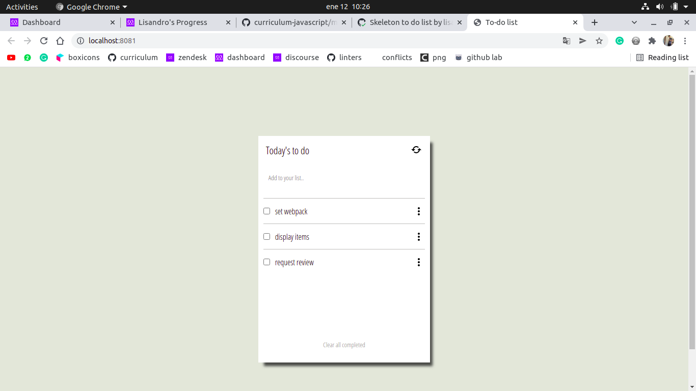

# To-do list

> In this project i made a scheleton and most of the functionalities for the to-do list.

With  this project you can track all of your daily activities, adding, removing, and editing it.

## Built With

- Html, css & JS
- Webpack, BoxIcons
- Github

## Live Demo

[Live Demo Link](https://lisandroseia.github.io/to-do-list/)

## Getting Started

To get a local copy up and running follow these simple example steps.

### Prerequisites
WebPack package installing

### Setup
Run https://github.com/lisandroseia/to-do-list.git to clon the repository

### Install
run the following comands:
npm install webpack webpack-cli --save-dev
npm install --save-dev html-webpack-plugin
npm install --save-dev style-loader css-loader
npm install --save-dev webpack-dev-server

### Usage
Run the comand npm run start to get a working environment with the project I made

## Authors

👤 **Lisandro Seia**

- GitHub: [@lisandroseia](https://github.com/lisandroseia)
- LinkedIn: [LinkedIn](https://www.linkedin.com/in/lisandro-seia-295120225/)

## 🤝 Contributing

Contributions, issues, and feature requests are welcome!

Feel free to check the [issues page](https://github.com/lisandroseia/to-do-list/issues).

## Show your support

Give a ⭐️ if you like this project!

## Acknowledgments

- For this project I followed the page Minimalist, that is not existing anymore,
This was the functionality of [Minimalist](https://www.youtube.com/watch?v=AcUd-_Yjjqg)

## 📝 License

This project is [MIT](./MIT.md) licensed.
